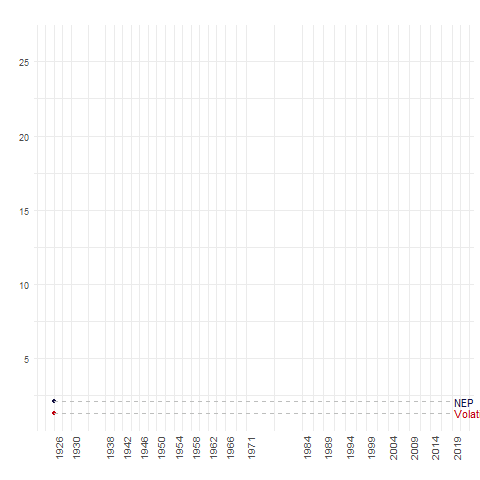
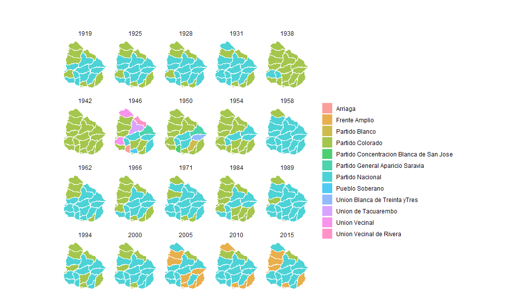

<!-- README.md is generated from README.Rmd. Please edit that file -->

```{r, include = FALSE}
knitr::opts_chunk$set(
  collapse = TRUE,
  comment = "#>",
  fig.path = "man/figures/README-",
  out.width = "60%"
)
```

## Borel<b style='color:blue'>uy</b>  

*Nicolás Schmidt, Antonio Cardarello, Diego Luján* 

<!-- badges: start -->

[](https://www.repostatus.org/#active)
[](https://travis-ci.com/Nicolas-Schmidt/Boreluy)
<!-- badges: end --> 

> Datos electorales de Uruguay 1918 - 2020. 

### Descripción 

Este paquete de R proporciona un conjunto de datos que contienen resultados electorales al máximo nivel de desagregación posible y comparable entre elecciones. Adicionalmente provee un conjunto de funciones que permiten obtener agregaciones de los datos (resultado por partido, por partido-departamento...).

El manual del paquete se puede encontrar [__aquí__](https://github.com/Nicolas-Schmidt/Boreluy/blob/master/man/figures/Manual_Boreluy.pdf).

> ¿Por qué Boreluy? Al belga J. Borely se le atribuye la creación del doble voto simultaneo (DVS). En conjunto con la representación proporcional el DVS son dos ideas que caracterizaron particularmente al sistema electoral uruguayo. No solo en Uruguay generó influencia el belga, de quien no se conoce más que una única obra. En Uruguay se lo conoció a través de Justino Jiménez de Aréchaga (un destacado constitucionalista uruguayo) quien enviara un proyecto de ley a principios del siglo XX que incorporaba la representación proporcional, el doble voto simultaneo y el reconocimiento de los partidos políticos en Uruguay. El nombre del paquete lleva el nombre del belga con una pequeña modificación (la incorporación de la letra 'u') para señalar que hace referencia a Uruguay dado que Borely también influenció en otros países. El logo es una caricatura de una foto de Justino Jiménez de Aréchaga ya que no se conocen fotos de J. Borely <sup><a id="fnr.1" class="footref" href="#fn.1">1</a></sup>.


### Instalación

``` r
## Versión en desarrollo
source("https://install-github.me/Nicolas-Schmidt/Boreluy")
```

### Contenido del paquete

#### Funciones

| Función |Descripción |
| ----------------- | -------------------------------------------------------------- | 
|`resultado_eleccion_uy`|Devuelve el resultado de una elección en cantidad de votos y porcentaje. También se puede obtener el resultado discriminado por departamento (`por_departamento = TRUE`) y la cantidad de cargos al parlamento en caso de elecciones Legislativas o Presidenciales concurrentes con elecciones Legislativas (`parlamento = TRUE`). Si usa el argumento `vbva.rm = TRUE` se eliminan del calculo los votos en blanco y anulado (esto puede ser útil para elecciones como el Balotaje).|
|`agrupar_partidos_uy`|Permite obtener el resultado electoral agrupando los partdos que obtuvieron menos de determinado umbral de votos en porcentaje (el umbral es definido por el usuario en la función) y tambien agrupa por defecto a los votos en blanco y a los votos anulados.|
|`as_esaps`|Convierte la salida de `resultado_eleccion_uy` al formatro de datos necesario para usar el paquete [`esaps`](https://nicolas-schmidt.github.io/esaps/index.html) que sirve para calcular indicadores relativos al sistema de partidos (volatilidad, número efectivo de partidos..) y sistema electoral (desproporcionalidad...).|
|`as_parliament`|Convierte la salida de `resultado_eleccion_uy(., parlamento = TRUE)` al formatro de datos necesario para usar el paquete [`ggparliament`](https://github.com/RobWHickman/ggparliament) que permite graficar la composición del parlamento en formatro parlamento ("horseshoe", "semicircle", "circle", "classroom", "opposing_benches").|

#### Conjuntos de datos

| Nombre|Descripción |
| ----------------- | -------------------------------------------------------------- | 
|`elecciones_uy`|Contiene los resultrados elctorales desagregado a nivel de departamento y en los casos que existe a nivel de sublema de las elecciones nacionales y departamentales desde 1918 hasta 2019.|
|`partidos_uy`|La undiad de esta base de datos son los partidos polítcos que alguna vez participaron en alguna elección en el período 1918 - 2019.|

### Ejemplos


### Elecciones Uruguayas
```{r}
library(Boreluy)
resumen_elecciones_uy()
```
### Resultados electorales

```{r}

library(ggplot2)
library(magrittr)


elec71 <- resultado_eleccion_uy(anio = 1971, tipo = 'Presidencial', por_departamento = FALSE)

elec71


ggplot(data = elec71 , aes(x = reorder(Partido, Porcentaje), y = Porcentaje)) +
    geom_bar(stat = "identity", position = "stack", fill = "#00A08A", color = "black") +
    ylim(0,100) +
    coord_flip() +
    geom_text(aes(label = paste0(Porcentaje, "%")), hjust = -0.5, color = "gray9", size = 3) +
    labs(x = "", y = "",
         title = "Resultado de elección nacional de 1971",
         subtitle = "28 de noviembre de 1971") +
    theme_minimal()
```


```{r, out.width = "100%", out.height = "100%"}
elec71 <- resultado_eleccion_uy(1971, 'Presidencial', por_departamento = TRUE) 

ggplot(data = elec71 , aes(x = reorder(Sigla, Porcentaje), y = Porcentaje)) +
    geom_bar(stat="identity", position = "stack", fill = "#00A08A", color = "black") +
    ylim(0,100) +
    coord_flip() +
    geom_text(aes(label = paste0(Porcentaje, "%")), hjust = -0.5, color = "gray9", size = 2) +
    labs(x = "", y = "",
         title = "Resultado de elección nacional de 1971",
         subtitle = "28 de noviembre de 1971") +
    theme_minimal() + 
    theme(axis.text.x = element_text(size = 6),
          axis.text.y = element_text(size = 6)) +
    facet_wrap(~Departamento)

```

### Parlamento

```{r}
library(ggparliament)

resultado_eleccion_uy(anio = 1971, tipo = 'Presidencial', parlamento = TRUE)


# creamos una funcion para graficar parlamento
par_uy <- function(datos, titulo, mayoria, ...){
    
    ggplot(datos, aes(x, y, colour = party_long)) +
    geom_parliament_seats() + 
    geom_highlight_government(government == 1) +
    draw_majoritythreshold(n = mayoria, label = FALSE, type = 'semicircle') +
    geom_parliament_bar(colour = colour, party = party_long) + 
    theme_ggparliament() +
    labs(colour = NULL, 
         title = titulo,
         subtitle = "") +
    scale_colour_manual(values = datos$colour,
                        limits = datos$party_long)
}

```

#### Camara de Representantes

```{r}
diputados <- 
    resultado_eleccion_uy(anio = 1971, tipo = 'Presidencial', parlamento = TRUE) %>% 
    Boreluy::as_parliament(., camara = 1, color = c('#E81B23', '#3333FF', '#B4B4B4')) %>% 
    par_uy(., titulo = "Camara de Representantes Uruguay 1971", mayoria = 51)

diputados
```

#### Camara de Senadores

```{r}
senadores <- 
    resultado_eleccion_uy(anio = 1971, tipo = 'Presidencial', parlamento = TRUE) %>% 
    Boreluy::as_parliament(., camara = 2, color = c('#E81B23', '#3333FF', '#B4B4B4')) %>% 
    par_uy(., titulo = "Camara de Senadores Uruguay 1971", mayoria = 16)

senadores

```

#### Aplicaciones alternativas

```{r}
datos <- 
    purrr::map_df(c(1984, 1989, 1994, 1999, 2004), resultado_eleccion_uy, 'Presidencial') %>% 
    as_esaps()

## Volatilidad electoral

esaps::evolat(datos, "Pedersen")


## Número efectivo de partidos

esaps::enp(datos)

```




#### Elecciones departamentales





```{r, echo = FALSE, message = FALSE}
manual <- function(){
    old <- here::here()
    path <- here::here('man', 'figures')
    sink('noise.txt')
    devtools::build_manual(path = path)
    sink()
    setwd(path)
    invisible(file.rename(list.files(pattern="^Boreluy"), 'Manual_Boreluy.pdf'))
    setwd(old)
    invisible(file.remove('noise.txt'))
}
manual()
```


---

##### Mantenedor
Nicolás Schmidt (<nschmidt@cienciassociales.edu.uy>)

##### Diseño de logo 
Nadia Repetto (<narepetto@gmail.com>)


#### Notas

---
<sup><a id="fn.1" href="#fnr.1">1</a></sup> Ver Buquer, Daniel (2004) _Elecciones y sistema electoral_. En: El Uruguay del siglo XX. La Política. Ediciones de la Banda Oriental - Instituto de Ciencia Política.
