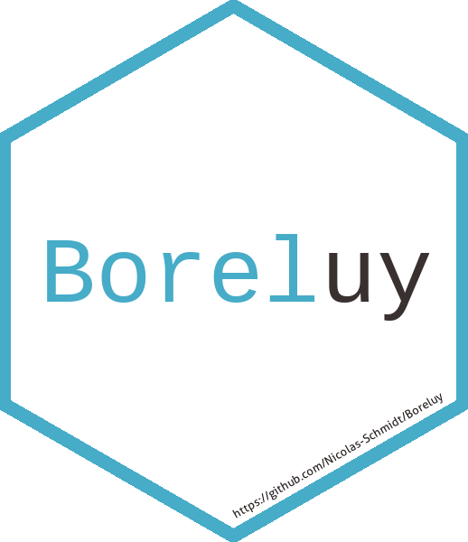

<!-- README.md is generated from README.Rmd. Please edit that file -->

## The `Boreluy` package 

*Nicolas Schmidt, Antonio Cardarello, Diego Lujan*

<!-- badges: start -->

[](https://www.repostatus.org/#active)
<!-- badges: end --> <!-- badges: end -->

### Description

### Installation

``` r
# install.packages("devtools")
devtools::install_github("Nicolas-Schmidt/`Boreluy")
```

## Elecciones

``` r
library(Boreluy)
library(ggplot2)
library(magrittr)


elec71 <- resultado_elecciones_uy(anio = 1971, tipo = 'Presidencial', por_departamento = FALSE)

ggplot(data = elec71 , aes(x = reorder(Partido, Porcentaje), y = Porcentaje)) +
    geom_bar(stat = "identity", position = "stack", fill = "#00A08A", color = "black") +
    ylim(0,100) +
    coord_flip() +
    geom_text(aes(label = paste0(Porcentaje, "%")), hjust = -0.5, color = "gray9", size = 3) +
    labs(x = "", y = "",
         title = "Resultado de elección nacional de 1971",
         subtitle = "28 de noviembre de 1971") +
    theme_minimal()
```


``` r
elec71 <- resultado_elecciones_uy(1971, 'Presidencial', por_departamento = TRUE) 

ggplot(data = elec71 , aes(x = reorder(Sigla, Porcentaje), y = Porcentaje)) +
    geom_bar(stat="identity", position = "stack", fill = "#00A08A", color = "black") +
    ylim(0,100) +
    coord_flip() +
    geom_text(aes(label = paste0(Porcentaje, "%")), hjust = -0.5, color = "gray9", size = 2) +
    labs(x = "", y = "",
         title = "Resultado de elección nacional de 1971",
         subtitle = "28 de noviembre de 1971") +
    theme_minimal() + 
    theme(axis.text.x = element_text(size = 6),
          axis.text.y = element_text(size = 6)) +
    facet_wrap(~Departamento)
```


## Parlamento

``` r
library(ggparliament)

diputados <- 
    parlamento_uy(anio = 1971, por_departamento = FALSE) %>% 
    as_parliament(., camara = 1, color = c('#E81B23', '#3333FF', '#B4B4B4'))

ggplot(diputados, aes(x, y, colour = party_long)) +
    geom_parliament_seats() + 
    geom_highlight_government(government == 1) +
    draw_majoritythreshold(n = 51, label = FALSE, type = 'semicircle') +
    geom_parliament_bar(colour = colour, party = party_long) + 
    theme_ggparliament() +
    labs(colour = NULL, 
         title = "Camara de Representantes Uruguay 1971",
         subtitle = "") +
    scale_colour_manual(values = diputados$colour,
                        limits = diputados$party_long)
```


